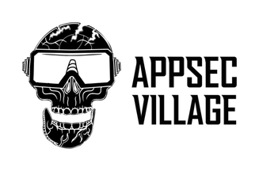
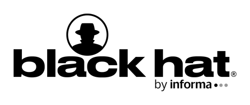
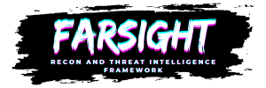
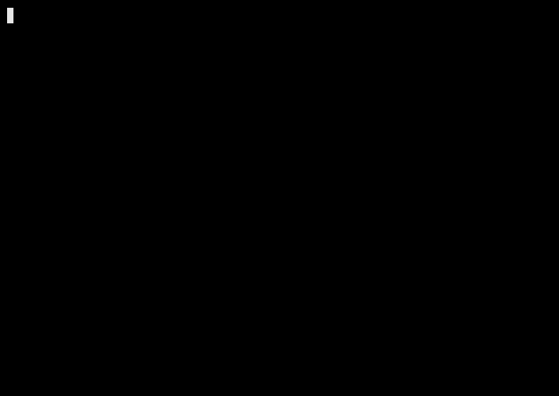

<div align="center">

<table>
<tr>
<td align="center" width="50%">

### DEFCON 34

<a href="https://sessionize.com/adlin-seedon-dsouza/">

</a>

<sub>🗓️ Aug 6–9, 2026 &nbsp;•&nbsp; Las Vegas &nbsp;•&nbsp; Upcoming</sub>

**[Farsight: Turning OSINT into Actionable Attack Surface Intelligence](https://sessionize.com/adlin-seedon-dsouza/)**

</td>
<td align="center" width="50%">

### BLACKHAT 2025

<a href="https://www.blackhat.com/sector/2025/arsenal/schedule/index.html#farsight-cli-based-recon-and-threat-intelligence-framework-47707">

</a>

<sub>🎯 Oct 1–2, 2025 &nbsp;•&nbsp; Toronto &nbsp;•&nbsp; Presented</sub>

**[Arsenal: CLI-Based Recon and Threat Intelligence Framework](https://www.blackhat.com/sector/2025/arsenal/schedule/index.html#farsight-cli-based-recon-and-threat-intelligence-framework-47707)**

</td>
</tr>
</table>

</div>

<p align="center">
  
</p>

# FARSIGHT

[](https://python.org)
[](LICENSE)
[](https://github.com/seedon198/Farsight/stargazers)
[](https://github.com/seedon198/Farsight/actions)
[](https://github.com/psf/black)
[](https://github.com/seedon198/Farsight/commits/main)

**A fast, modular CLI recon and threat-intelligence framework. Works with or without API keys.**

<p align="center">
  
</p>

## Features

- **Organization Discovery:** WHOIS, certificate transparency, passive DNS, related domains
- **Recon & Asset Discovery:** DNS enumeration, subdomain discovery, async port scanning
- **Threat Intelligence:** leak detection, credential exposure, dark web mentions, email reputation
- **Typosquatting Detection:** domain permutation, content similarity, risk scoring
- **News Monitoring:** relevance-scored news tracking across multiple sources
- **Reporting:** Markdown and PDF output with executive summaries
- **API-optional:** works out of the box; add keys (Shodan, Censys, VirusTotal, ...) for deeper results

## Install

```bash
git clone https://github.com/seedon198/Farsight.git
cd Farsight
python3 -m venv venv && source venv/bin/activate
pip install -r requirements.txt
```

Requires Python 3.10+.

## Usage

```bash
# Basic scan (org discovery + recon)
python -m farsight scan example.com

# Everything, verbose
python -m farsight scan example.com --all --verbose

# Specific modules, PDF output
python -m farsight scan example.com -m org -m threat --output report.pdf
```

Run `python -m farsight scan --help` for the full option list.

## API Keys (optional)

FARSIGHT works with zero configuration. Set these for deeper results:

```bash
export FARSIGHT_SHODAN_API_KEY="..."
export FARSIGHT_CENSYS_API_KEY="..."
export FARSIGHT_SECURITYTRAILS_API_KEY="..."
export FARSIGHT_VIRUSTOTAL_API_KEY="..."
export FARSIGHT_INTELX_API_KEY="..."
export FARSIGHT_LEAKPEEK_API_KEY="..."
```

## Development

```bash
pip install -r requirements-dev.txt
pytest tests/
```

Contributions welcome: fork, branch, open a PR.

## License

MIT. See [LICENSE](LICENSE).

## Disclaimer

For authorized security assessments only. Always get permission before scanning a domain or network you don't own.
